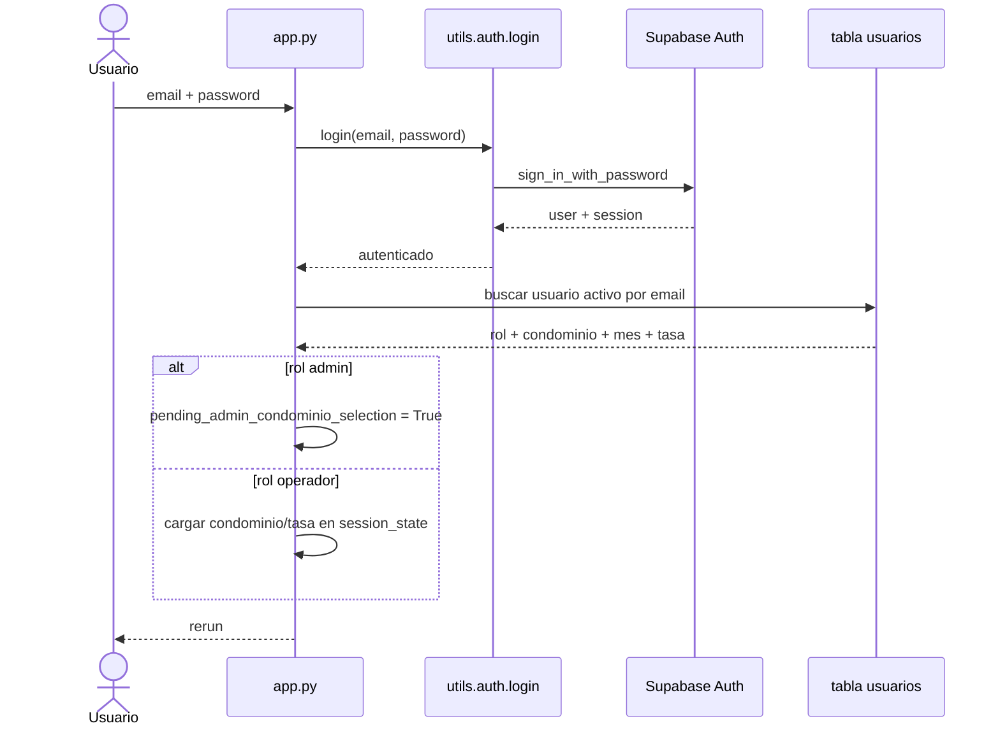

# Autenticación y contexto

## Función principal
Permitir que un usuario entre al sistema, herede un rol operativo y trabaje dentro del contexto de un condominio activo con período y tasa BCV cargados en sesión.

## Conceptos
- `authenticated`: bandera de sesión que habilita páginas protegidas.
- `user_role`: rol operativo. En la práctica el sistema trabaja con `admin` y `operador`; `consulta` se trata como compatibilidad histórica.
- `condominio activo`: edificio o conjunto sobre el que opera el usuario actual.
- `mes_proceso`: período operativo visible en UI, guardado en formato `MM/YYYY`.
- `tasa_cambio`: tasa Bs./USD usada como referencia visual y respaldo de cálculo.

## Subproceso: inicio de sesión

### Entradas
| Parámetro | Tipo | Origen | Obligatorio | Descripción |
|---|---|---|---|---|
| `email` | string | formulario `app.py` | Sí | Credencial del usuario |
| `password` | string | formulario `app.py` | Sí | Contraseña validada en Supabase Auth |

### Devuelve / genera
- Autenticación en Supabase Auth mediante `utils.auth.login()`.
- Carga del registro del usuario desde tabla `usuarios`.
- Inicialización de `st.session_state` con correo, rol, condominio, mes y tasa.
- Redirección por `st.rerun()` al dashboard o a selección de condominio.

### Reglas funcionales
- Si el login es correcto pero el usuario está inactivo en tabla `usuarios`, el flujo falla.
- Si el rol es `admin`, no entra directo a un condominio: primero debe elegir uno.
- Si el rol no es `admin`, hereda el condominio asignado y entra directo.
- La tasa BCV intenta resolverse en tiempo real con `utils.bcv_rate.fetch_bcv_rate()`; si falla, usa la del condominio.

### Diagrama de secuencia


## Subproceso: selección de condominio para administrador

### Entradas
| Parámetro | Tipo | Origen | Obligatorio | Descripción |
|---|---|---|---|---|
| `pending_admin_condominio_selection` | bool | sesión | Sí | Activa pantalla de selección |
| `condominio_id` | int | selectbox | Sí | Condominio elegido |

### Devuelve / genera
- Carga completa de contexto con `utils.auth.apply_condominio_to_session(condominio_id)`.
- Población de `condominio_nombre`, `condominio_pais`, `condominio_moneda`, `mes_proceso`, `tasa_cambio`, `tasa_fuente`.

### Reglas funcionales
- Solo lista condominios activos.
- Si no existen condominios activos, el flujo deriva al módulo `Condominios`.
- El header solo se renderiza después de tener condominio activo.

## Subproceso: protección de páginas

### Entradas
| Parámetro | Tipo | Origen | Obligatorio | Descripción |
|---|---|---|---|---|
| `authenticated` | bool | sesión | Sí | Sesión iniciada |
| `condominio_id` | int | sesión | Según módulo | Contexto operativo activo |
| `required_role` | string | página | No | Rol mínimo del módulo |

### Devuelve / genera
- `check_authentication()`: permite continuar o detiene la ejecución.
- `require_condominio()`: obliga a tener condominio activo.
- `check_permission()`: bloquea módulos restringidos, por ejemplo `Usuarios`.

### Orden técnico correcto
1. `st.set_page_config(...)`
2. `check_authentication()`
3. `render_header()`

Si se altera ese orden, la app puede mostrar navegación inconsistente o detenerse sin shell visual.

## Subproceso: autologin de QA

### Entradas
| Variable | Tipo | Obligatoria | Descripción |
|---|---|---|---|
| `CONDOSYS_DEV_AUTOLOGIN` | string | No | Debe ser `1` para activarse |
| `CONDOSYS_DEV_AUTOLOGIN_EMAIL` | string | Sí si hay autologin | Email del usuario a simular |

### Devuelve / genera
- Salta la UI de login y construye sesión con el usuario encontrado.
- Se usa en `app.py` y `utils/auth.py`, especialmente para QA local y Playwright.

## Salidas de sesión relevantes
| Clave | Tipo | Uso |
|---|---|---|
| `user_email` | string | Header, auditoría y restricciones de auto-desactivación |
| `user_role` | string | Autorización por módulo |
| `condominio_id` | int | Filtro transversal de repositorios |
| `condominio_nombre` | string | Header y reportes |
| `mes_proceso` | string `MM/YYYY` | UI, pagos, reportes, proceso mensual |
| `tasa_cambio` | float | Referencia visual y respaldo de cálculos |
| `tasa_fuente` | string | Indica origen de la tasa |

## Ejemplos de payloads / estructuras

### Registro de usuario consultado tras login
```json
{
  "id": 12,
  "condominio_id": 3,
  "nombre": "Ana Administradora",
  "email": "admin@condominio.com",
  "rol": "admin",
  "activo": true,
  "condominios": {
    "nombre": "Residencias El Parque",
    "mes_proceso": "2026-03-01",
    "tasa_cambio": 97.15
  }
}
```

### Session state operativo esperado
```json
{
  "authenticated": true,
  "user_email": "admin@condominio.com",
  "user_role": "admin",
  "condominio_id": 3,
  "condominio_nombre": "Residencias El Parque",
  "mes_proceso": "03/2026",
  "tasa_cambio": 97.15,
  "tasa_fuente": "BCV oficial"
}
```

## Tablas Supabase implicadas
| Tabla | Uso en el flujo | Campos relevantes |
|---|---|---|
| `usuarios` | Lookup posterior al login | `email`, `activo`, `rol`, `condominio_id` |
| `condominios` | Contexto del condominio activo | `nombre`, `mes_proceso`, `tasa_cambio` |

## Archivos clave
- `app.py`
- `utils/auth.py`
- `config/supabase_client.py`
- `components/header.py`
