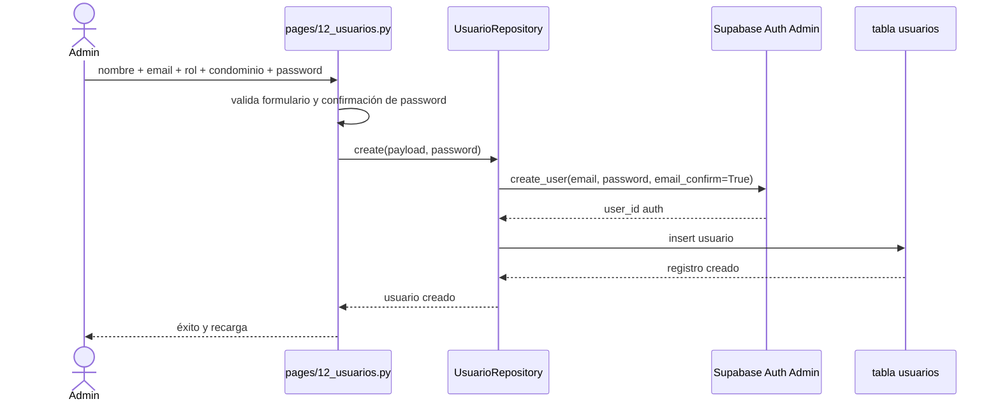

# Administración maestra

## Función principal
Mantener los datos base con los que opera todo el sistema: condominios, unidades, propietarios, empleados, proveedores y usuarios.

## Conceptos
- `CRUD`: crear, consultar, actualizar y eliminar.
- `activo`: bandera lógica de vigencia. En algunos módulos se prefiere desactivar antes que eliminar.
- `condominio_id`: partición funcional principal del sistema.
- `propietario`: persona o entidad asociada a una o más unidades.
- `unidad`: elemento cobrable y distribuible del condominio.

## Módulo: Condominios

### Función principal
Registrar los datos maestros del condominio y los parámetros que condicionan la operación global: país, documento, moneda, mes en proceso, tasa BCV y configuración SMTP.

### Entradas principales
| Parámetro | Tipo | Obligatorio | Descripción |
|---|---|---|---|
| `nombre` | string | Sí | Nombre del condominio |
| `direccion` | string | Sí | Dirección principal |
| `pais_id` | int | Sí | País base para validaciones y moneda |
| `tipo_documento_id` | int | No | Tipo fiscal según país |
| `numero_documento` | string | No | RIF/NIT/RUC/CUIT |
| `mes_proceso` | date | No | Período activo del condominio |
| `tasa_cambio` | float | No | Respaldo local de Bs./USD |
| `dia_limite_pago` | int | No | Día de referencia para mora, 1 a 28 |

### Devuelve / genera
- Registros en tabla `condominios`.
- Configuración leída por login, header, proceso mensual, pagos y notificaciones.

### Subprocesos
1. Crear condominio.
2. Editar datos base.
3. Activar o desactivar condominio.
4. Obtener `dia_limite_pago` para cálculos de mora.
5. Configurar SMTP para notificaciones de mora.

### Payload de ejemplo
```json
{
  "nombre": "Residencias El Parque",
  "direccion": "Av. Principal, Caracas",
  "pais_id": 1,
  "tipo_documento_id": 1,
  "numero_documento": "J-12345678-9",
  "telefono": "0212-5551234",
  "email": "admin@elparque.com",
  "mes_proceso": "2026-03-01",
  "tasa_cambio": 97.15,
  "dia_limite_pago": 15,
  "activo": true
}
```

## Módulo: Unidades

### Función principal
Administrar el padrón de unidades y su peso financiero mediante `indiviso_pct`, saldo y estado de pago.

### Entradas principales
| Parámetro | Tipo | Obligatorio | Descripción |
|---|---|---|---|
| `codigo` | string | Sí | Identificador visible de la unidad |
| `tipo_propiedad` | string | Sí | Apartamento, casa, local, etc. |
| `indiviso_pct` | float | Sí | Porcentaje de participación |
| `propietario_id` | int | No | Relación con propietario |
| `tipo_condomino` | string | No | Propietario o arrendatario |
| `saldo` | float | No | Deuda acumulada histórica |
| `estado_pago` | string | No | `al_dia`, `parcial`, `moroso` |

### Devuelve / genera
- Registros en tabla `unidades` con join a `propietarios`.
- Cálculo de cuota estimada por presupuesto desde `get_with_cuota()`.
- Indicadores de ocupación financiera: total, morosos, porcentaje de indiviso asignado.

### Reglas funcionales
- `codigo` es obligatorio en creación y edición.
- El saldo se normaliza a `0.00` cuando viene vacío.
- La UI valida que la suma de indivisos se mantenga en 100% con tolerancia.

### Subprocesos
1. Alta de unidad.
2. Edición parcial de saldo y `estado_pago` desde pagos o cierre mensual.
3. Consulta de indicadores de unidades.
4. Asignación o desasignación de propietario.

### Payload de ejemplo
```json
{
  "condominio_id": 3,
  "codigo": "A-3B",
  "tipo_propiedad": "Apartamento",
  "indiviso_pct": 4.5,
  "propietario_id": 42,
  "tipo_condomino": "Propietario",
  "saldo": 0.0,
  "estado_pago": "al_dia",
  "activo": true
}
```

## Módulo: Propietarios

### Función principal
Registrar titulares y contactos usados por estados de cuenta, reportes y notificaciones.

### Entradas principales
| Parámetro | Tipo | Obligatorio |
|---|---|---|
| `nombre` | string | Sí |
| `cedula` | string | Sí |
| `telefono` | string | No |
| `correo` | string | No |
| `direccion` | string | No |
| `notas` | string | No |
| `activo` | bool | No |

### Devuelve / genera
- Registros en tabla `propietarios`.
- Relación visible desde `unidades`, `reportes` y `estado de cuenta`.

### Reglas funcionales
- El correo se valida como email si se suministra.
- La eliminación puede fallar si el propietario está referenciado por unidades.

### Payload de ejemplo
```json
{
  "condominio_id": 3,
  "nombre": "María Pérez",
  "cedula": "V12345678",
  "telefono": "04141234567",
  "correo": "maria@example.com",
  "direccion": "Torre A, piso 3",
  "notas": "Propietaria principal",
  "activo": true
}
```

## Módulo: Empleados

### Función principal
Registrar personal operativo del condominio para administración interna y gasto recurrente.

### Entradas principales
| Parámetro | Tipo | Obligatorio |
|---|---|---|
| `nombre` | string | Sí |
| `cargo` | string | Sí |
| `area` | string | Sí |
| `telefono_celular` | string | No |
| `correo` | string | No |
| `activo` | bool | No |

### Devuelve / genera
- Registros en tabla `empleados`.

### Reglas funcionales
- El teléfono celular se valida con formato venezolano cuando se carga.
- Se usa principalmente como catálogo administrativo; no dispara cálculos por sí mismo.

### Payload de ejemplo
```json
{
  "condominio_id": 3,
  "nombre": "Carlos Gómez",
  "cargo": "Conserje",
  "area": "Mantenimiento",
  "direccion": "Residencias El Parque",
  "telefono_fijo": "02125551234",
  "telefono_celular": "04141234567",
  "correo": "carlos@example.com",
  "notas": "Turno mañana",
  "activo": true
}
```

## Módulo: Proveedores

### Función principal
Registrar terceros que emiten facturas o prestan servicios al condominio.

### Entradas principales
| Parámetro | Tipo | Obligatorio |
|---|---|---|
| `nombre` | string | Sí |
| `tipo_documento_id` | int | No |
| `numero_documento` | string | Sí en formulario |
| `direccion` | string | No |
| `telefono_fijo` | string | No |
| `telefono_celular` | string | No |
| `correo` | string | No |
| `contacto` | string | No |
| `saldo` | float | No |
| `activo` | bool | No |

### Devuelve / genera
- Registros en tabla `proveedores`.
- Base de selección para facturas de proveedor.

### Reglas funcionales
- El módulo muestra el saldo pendiente derivado del historial de facturas.
- La pantalla integra una pestaña relacionada de facturas, pero cada dominio persiste en su tabla propia.

### Payload de ejemplo
```json
{
  "condominio_id": 3,
  "nombre": "Servicios Técnicos CA",
  "tipo_documento_id": 1,
  "numero_documento": "J-98765432-1",
  "direccion": "Caracas",
  "telefono_fijo": "02124441234",
  "telefono_celular": "04141234567",
  "correo": "contacto@servicios.com",
  "contacto": "Juan Pérez",
  "saldo": 0,
  "activo": true
}
```

## Módulo: Usuarios

### Función principal
Gestionar quién puede entrar al sistema y con qué permisos.

### Entradas principales
| Parámetro | Tipo | Obligatorio |
|---|---|---|
| `nombre` | string | Sí |
| `email` | string | Sí |
| `rol` | string | Sí |
| `condominio_id` | int | Sí |
| `password` | string | Sí solo al crear o cambiar |
| `activo` | bool | No |

### Devuelve / genera
- Usuario en Supabase Auth mediante `get_admin_client().auth.admin.create_user(...)`.
- Registro espejo en tabla `usuarios`.
- Cambio de contraseña vía API admin de Supabase.

### Reglas funcionales
- Módulo restringido a `admin`.
- El email no se puede modificar desde la UI una vez creado.
- Un usuario no puede desactivarse a sí mismo.
- La contraseña mínima es de 8 caracteres.
- `SUPABASE_SERVICE_KEY` es obligatoria para crear usuarios o cambiar contraseñas.

### Diagrama de secuencia: alta de usuario


### Payload de ejemplo
```json
{
  "nombre": "Ana Administradora",
  "email": "admin@condominio.com",
  "rol": "admin",
  "condominio_id": 3,
  "activo": true,
  "password": "secreto123"
}
```

## Tablas Supabase implicadas
| Módulo | Tablas principales | Tablas relacionadas |
|---|---|---|
| Condominios | `condominios` | `paises`, `tipos_documento` |
| Unidades | `unidades` | `propietarios`, `unidad_propietarios`, `alicuotas` |
| Propietarios | `propietarios` | `unidades` |
| Empleados | `empleados` | ninguna obligatoria |
| Proveedores | `proveedores` | `tipos_documento`, `facturas_proveedor` |
| Usuarios | `usuarios` | `condominios`, Supabase Auth |

## Archivos clave
- `pages/01_condominios.py`
- `pages/02_unidades.py`
- `pages/10_empleados.py`
- `pages/11_propietarios.py`
- `pages/12_usuarios.py`
- `pages/13_proveedores.py`
- `repositories/condominio_repository.py`
- `repositories/unidad_repository.py`
- `repositories/propietario_repository.py`
- `repositories/empleado_repository.py`
- `repositories/proveedor_repository.py`
- `repositories/usuario_repository.py`
