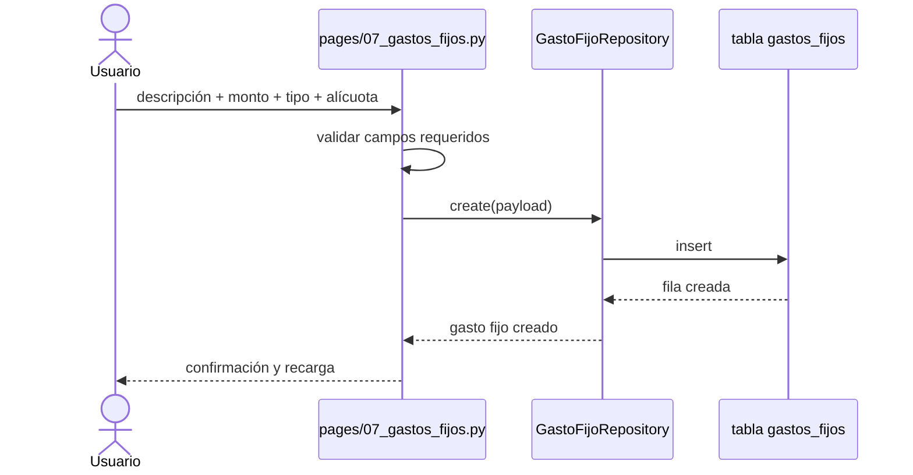

# Configuración financiera

## Función principal
Definir las reglas y catálogos con los que el sistema distribuye gastos, clasifica movimientos y calcula cuotas del período.

## Conceptos
- `alícuota`: fracción del gasto común asignada a una unidad o grupo.
- `concepto`: clasificación contable del movimiento.
- `gasto fijo`: egreso recurrente mensual.
- `servicio`: catálogo de servicios cobrables o administrables sin precio fijo en este módulo.

## Módulo: Alícuotas

### Función principal
Mantener la estructura de distribución proporcional del condominio.

### Entradas principales
| Parámetro | Tipo | Obligatorio |
|---|---|---|
| `descripcion` | string | Sí |
| `autocalcular` | bool | No |
| `cantidad_unidades` | int | Sí si autocalcula |
| `total_alicuota` | float | Sí |
| `activo` | bool | No |

### Devuelve / genera
- Registros en tabla `alicuotas`.
- Validación de suma global aproximada a `1.00`.
- Recalculo desde número de unidades activas.

### Reglas funcionales
- No se permite eliminar alícuotas una vez creadas.
- No se permite modificar una alícuota si ya está asignada a unidades.
- `total_alicuota` debe ser válido y la suma total del condominio debe mantenerse consistente.

### Subprocesos
1. Crear alícuota manual.
2. Crear alícuota autocalculada como `1 / cantidad_unidades`.
3. Recalcular alícuota desde unidades activas.
4. Bloquear modificación si ya existe asignación.

### Payload de ejemplo
```json
{
  "condominio_id": 3,
  "descripcion": "Alicuota general",
  "autocalcular": false,
  "cantidad_unidades": 24,
  "total_alicuota": 0.041667,
  "activo": true
}
```

## Módulo: Conceptos

### Función principal
Clasificar movimientos financieros del condominio.

### Entradas principales
| Parámetro | Tipo | Obligatorio |
|---|---|---|
| `nombre` | string | Sí |
| `tipo` | enum | Sí |
| `activo` | bool | No |

### Valores de tipo verificados
- `gasto`
- `ajuste`

### Devuelve / genera
- Catálogo en tabla `conceptos`.
- Selección obligatoria para clasificar movimientos bancarios.

### Reglas funcionales
- No se puede eliminar un concepto si ya fue usado en movimientos del período activo.
- El módulo filtra visualmente por tipo para facilitar operación.

### Payload de ejemplo
```json
{
  "condominio_id": 3,
  "nombre": "Mantenimiento ascensor",
  "tipo": "gasto",
  "activo": true
}
```

## Módulo: Servicios

### Función principal
Mantener el catálogo de servicios del condominio.

### Entradas principales
| Parámetro | Tipo | Obligatorio |
|---|---|---|
| `nombre` | string | Sí |
| `activo` | bool | No |

### Devuelve / genera
- Catálogo en tabla `servicios`.

### Reglas funcionales
- El módulo aclara explícitamente que el precio no se fija aquí; el monto se registra al momento del movimiento o cobro asociado.

### Payload de ejemplo
```json
{
  "condominio_id": 3,
  "nombre": "Salón de fiestas",
  "activo": true
}
```

## Módulo: Gastos fijos

### Función principal
Registrar egresos recurrentes que alimentan el presupuesto mensual y la distribución hacia las unidades.

### Entradas principales
| Parámetro | Tipo | Obligatorio |
|---|---|---|
| `descripcion` | string | Sí |
| `tipo_gasto` | enum | Sí |
| `monto` | float | Sí |
| `alicuota_id` | int o null | No |

### Tipos de gasto verificados
- `Nómina`
- `Servicio recurrente`
- `Contrato`

### Devuelve / genera
- Registros en tabla `gastos_fijos`.
- Asociación opcional a una alícuota concreta o distribución general del condominio.

### Reglas funcionales
- Si no se asigna `alicuota_id`, el gasto queda a nivel de condominio general.
- Los gastos fijos se visualizan con su total mensual agregado en la UI.

### Payload de ejemplo
```json
{
  "condominio_id": 3,
  "descripcion": "Servicio de vigilancia",
  "monto": 450.0,
  "tipo_gasto": "Contrato",
  "alicuota_id": 8
}
```

## Diagrama de secuencia: creación de gasto fijo


## Contratos técnicos resumidos

### `AlicuotaRepository`
| Método | Entrada | Devuelve | Observación |
|---|---|---|---|
| `get_all(condominio_id, solo_activos)` | condominio | lista | Ordena por descripción |
| `create(data)` | payload | dict | Valida total y suma global |
| `update(alicuota_id, data)` | id + payload | dict | Bloquea si está asignada |
| `recalcular_desde_unidades(alicuota_id, total_unidades)` | id + total | dict | Reescribe cantidad y total |

### `ConceptoRepository`
| Método | Entrada | Devuelve | Observación |
|---|---|---|---|
| `create(data)` | payload | dict | Crea concepto financiero |
| `can_delete(id, condominio_id)` | ids | bool | Lo usa la UI antes de eliminar |

### `ServicioRepository`
| Método | Entrada | Devuelve |
|---|---|---|
| `get_all(condominio_id)` | id | lista |
| `create(data)` | payload | dict |
| `update(servicio_id, data)` | id + payload | dict |

### `GastoFijoRepository`
| Método | Entrada | Devuelve |
|---|---|---|
| `get_all(condominio_id)` | id | lista |
| `create(data)` | payload | dict |
| `update(gasto_id, data)` | id + payload | dict |

## Tablas Supabase implicadas
| Módulo | Tablas principales | Tablas relacionadas |
|---|---|---|
| Alícuotas | `alicuotas` | `unidades` |
| Conceptos | `conceptos` | `movimientos`, `condominios` |
| Servicios | `servicios` | ninguna obligatoria |
| Gastos fijos | `gastos_fijos` | `alicuotas` |

## Archivos clave
- `pages/03_alicuotas.py`
- `pages/05_servicios.py`
- `pages/06_conceptos.py`
- `pages/07_gastos_fijos.py`
- `repositories/alicuota_repository.py`
- `repositories/concepto_repository.py`
- `repositories/servicio_repository.py`
- `repositories/gasto_fijo_repository.py`
