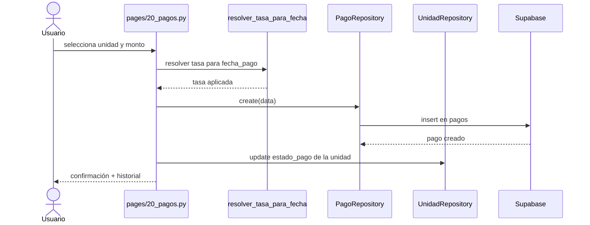

# Facturación, cobros y bancos

## Función principal
Registrar obligaciones con proveedores, recibir pagos de condóminos, importar movimientos bancarios y consolidar documentos de soporte como recibos y estados de cuenta.

## Conceptos
- `factura_proveedor`: cuenta por pagar del condominio.
- `pago`: ingreso asociado a una unidad y a un período.
- `movimiento`: registro bancario clasificado como ingreso o egreso.
- `conciliación`: relación entre movimiento bancario e intención contable.
- `recibo`: relación de gastos redistribuidos por unidad.
- `estado de cuenta`: resumen financiero de una unidad en un período.

## Módulo: Facturas de proveedor

### Función principal
Controlar documentos por pagar a terceros, su vencimiento y el monto abonado.

### Entradas principales
| Parámetro | Tipo | Obligatorio |
|---|---|---|
| `numero` | string | Sí |
| `proveedor_id` | int | Sí |
| `fecha` | date | Sí |
| `fecha_vencimiento` | date | No |
| `descripcion` | string | No |
| `total` | float | Sí |
| `pagado` | float | No |
| `mes_proceso` | date | Sí derivado de sesión |

### Devuelve / genera
- Registro en tabla `facturas_proveedor`.
- `saldo` calculado como `total - pagado`.
- Filtrado por mes en proceso o histórico completo.

### Reglas funcionales
- `pagado` no puede superar `total`.
- La pantalla de proveedores y la pantalla dedicada de facturas comparten el mismo dominio de datos.

### Payload de ejemplo
```json
{
  "condominio_id": 3,
  "numero": "0001-00012345",
  "fecha": "2026-03-05",
  "fecha_vencimiento": "2026-03-20",
  "proveedor_id": 55,
  "descripcion": "Mantenimiento general",
  "total": 500.0,
  "pagado": 200.0,
  "mes_proceso": "2026-03-01",
  "activo": true
}
```

## Módulo: Pagos y cobros

### Función principal
Registrar pagos de condóminos, recalcular su equivalente en USD según la fecha del comprobante y refrescar el estado de pago de la unidad.

### Entradas principales
| Parámetro | Tipo | Obligatorio |
|---|---|---|
| `unidad_id` | int | Sí |
| `periodo` | date | Sí |
| `fecha_pago` | date | Sí |
| `monto_bs` | float | Sí |
| `metodo` | enum | Sí |
| `referencia` | string | Sí para transferencia |
| `observaciones` | string | No |

### Devuelve / genera
- Registro en tabla `pagos` con `monto_bs`, `monto_usd`, `tasa_cambio`, `estado`.
- Recalcula `estado_pago` de la unidad sin sobrescribir `unidades.saldo`.
- Muestra historial editable y permite corrección o eliminación del pago.

### Reglas funcionales
- No registra pagos en períodos cerrados.
- La tasa usada al guardar es la BCV oficial del día de `fecha_pago`; si no existe, usa tasa de respaldo de sesión/condominio.
- La referencia es obligatoria para transferencias tanto en alta como en edición.

### Payload de ejemplo
```json
{
  "condominio_id": 3,
  "unidad_id": 18,
  "propietario_id": 42,
  "periodo": "2026-03-01",
  "fecha_pago": "2026-03-15",
  "monto_bs": 120.5,
  "monto_usd": 1.24,
  "tasa_cambio": 97.15,
  "metodo": "transferencia",
  "referencia": "00991234",
  "observaciones": "Pago parcial",
  "estado": "confirmado"
}
```

### Diagrama de secuencia: registrar pago


## Módulo: Movimientos bancarios

### Función principal
Administrar el libro bancario del período, clasificar movimientos, importar extractos y conciliar ingresos.

### Subprocesos

#### 1. Listado de movimientos
- Separa egresos e ingresos.
- Filtra por período.
- Muestra concepto, unidad, propietario, estado y fuente.

#### 2. Clasificación manual
| Entrada | Descripción |
|---|---|
| `concepto_id` | Obligatorio para clasificar |
| `unidad_id` | Opcional |
| `propietario_id` | Opcional |
| `estado` | `pendiente` o `clasificado` |

Devuelve una actualización del movimiento en la tabla `movimientos`.

#### 3. Importación bancaria
| Entrada | Descripción |
|---|---|
| archivo `.xlsx` | Extracto bancario |
| parser detectado | BDV, Banesco, Bancamiga o Mercantil |
| mapeo de columnas | fecha, referencia, monto, beneficiario, concepto |

Devuelve:
- inserción de movimientos `excel`
- detección de duplicados
- intento de conciliación automática para ingresos
- sugerencias y alertas por tipo de movimiento

### Reglas funcionales
- Los movimientos procesados en períodos cerrados quedan solo lectura.
- Los ingresos importados intentan conciliación automática antes de quedar pendientes.
- La importación no duplica si referencia, monto, fecha y concepto coinciden con existentes.

### Payloads de ejemplo

#### Clasificación manual
```json
{
  "concepto_id": 7,
  "unidad_id": 18,
  "propietario_id": 42,
  "estado": "clasificado"
}
```

#### Movimiento importado desde banco
```json
{
  "condominio_id": 3,
  "periodo": "2026-03-01",
  "fecha": "2026-03-14",
  "descripcion": "TRANSFERENCIA PAGO CONDOMINIO",
  "referencia": "99881234",
  "tipo": "ingreso",
  "monto_bs": 120.5,
  "monto_usd": 0.0,
  "tasa_cambio": 0.0,
  "estado": "pendiente",
  "fuente": "excel"
}
```

## Módulo: Recibos

### Función principal
Construir la relación de gastos por unidad usando egresos del período o agrupaciones consolidadas desde Redistribución de Gastos.

### Entradas principales
| Parámetro | Tipo | Obligatorio |
|---|---|---|
| `periodo` | date | Sí |
| `unidad_id` | int | No, puede ser todas |
| `agrupaciones_guardadas` | lista | No |

### Devuelve / genera
- Líneas de recibo con `total_bs`, `total_usd`, fondo de reserva y total relacionado.
- PDF mediante `utils.recibo_pdf.generar_recibos_pdf`.

### Reglas funcionales
- Si existen agrupaciones guardadas, solo usa las marcadas como `recibo`.
- Si no existen agrupaciones, agrupa egresos crudos por concepto o descripción.
- Solo procesa unidades con `indiviso_pct > 0`.

## Módulo: Estado de cuenta

### Función principal
Mostrar el resumen financiero de una unidad en el período, su histórico de cuotas y sus movimientos asociados.

### Entradas principales
| Parámetro | Tipo | Obligatorio |
|---|---|---|
| `periodo` | date | Sí |
| `unidad_id` | int | Sí |

### Devuelve / genera
- Resumen: cuota, saldo anterior, pagos del mes y saldo final.
- Histórico leído desde `cuotas_unidad`.
- Movimientos del mes filtrados por unidad.

### Reglas funcionales
- Si no existe cuota calculada para la unidad en ese período, el módulo guía a ejecutar primero `Proceso mensual`.

## Tablas Supabase implicadas
| Módulo | Tablas principales | Tablas relacionadas |
|---|---|---|
| Facturas | `facturas_proveedor` | `proveedores` |
| Pagos | `pagos` | `unidades`, `propietarios`, `condominios` |
| Movimientos bancarios | `movimientos` | `conceptos`, `unidades`, `propietarios`, `conciliaciones` |
| Recibos | `movimientos` | `unidades`, `procesos_mensuales`, `agrupaciones_gasto` |
| Estado de cuenta | `cuotas_unidad` | `movimientos`, `unidades`, `propietarios` |

## Contratos técnicos resumidos

### `FacturaRepository`
| Método | Entrada | Devuelve |
|---|---|---|
| `get_by_mes_proceso(condominio_id, mes_proceso)` | ids | lista |
| `create(data)` | payload | dict |
| `registrar_pago(factura_id, monto_pago)` | id + monto | dict |

### `PagoRepository`
| Método | Entrada | Devuelve | Observación |
|---|---|---|---|
| `create(data)` | payload | dict | Valida referencia para transferencia |
| `update(pago_id, data)` | id + payload | dict | Revalida referencia |
| `get_indicadores_mes(condominio_id, periodo, presupuesto, suma_indiviso)` | agregados | dict | KPI del módulo |

### `MovimientoRepository`
| Método | Entrada | Devuelve |
|---|---|---|
| `get_all(condominio_id, periodo)` | filtro | lista |
| `get_by_tipo(condominio_id, periodo, tipo, estado)` | filtro | lista |
| `create(data)` | payload | dict |
| `mark_periodo_procesado(condominio_id, periodo)` | ids | cantidad |

## Archivos clave
- `pages/14_facturas.py`
- `pages/20_pagos.py`
- `pages/16_movimientos.py`
- `pages/19_recibos.py`
- `pages/18_estado_cuenta.py`
- `repositories/factura_repository.py`
- `repositories/pago_repository.py`
- `repositories/movimiento_repository.py`
