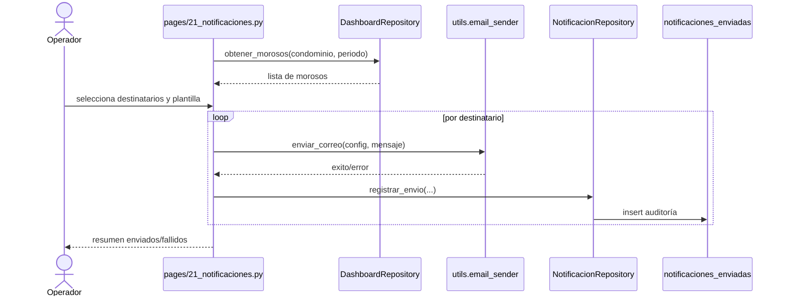

# Reportes, notificaciones y proceso mensual

## Función principal
Cerrar el ciclo operativo del período: preparar presupuesto, generar cuotas, registrar gastos e ingresos, emitir reportes, notificar morosos y cerrar el mes.

## Conceptos
- `proceso mensual`: estado operativo del mes (`borrador`, `procesado`, `cerrado`).
- `cuotas_unidad`: detalle por unidad con cuota, saldo anterior, pagos del mes y total a pagar.
- `moroso crítico`: unidad con más de un mes de atraso según `cuotas_unidad`.
- `historial de notificaciones`: auditoría de correos enviados.

## Módulo: Reportes

### Función principal
Generar PDFs operativos y financieros a partir de los datos ya consolidados del condominio.

### Reportes verificados
1. Estado de cuenta individual
2. Morosidad
3. Balance general
4. Libro de cobros
5. Libro de gastos
6. Origen y aplicación
7. Libro de solventes
8. Saldos acumulados iniciales

### Entradas transversales
| Parámetro | Tipo | Obligatorio |
|---|---|---|
| `condominio_id` | int | Sí |
| `periodo` | date | Sí en casi todos |
| `unidad_id` | int | Solo reportes unitarios |
| `tasa` | float | Requerida para equivalentes USD en PDFs |

### Devuelve / genera
- PDFs en memoria descargables desde la UI.
- Datos agregados construidos por `ReporteRepository` y `ReporteSaldosRepository`.

### Tablas Supabase implicadas
| Reporte | Tablas principales |
|---|---|
| Estado de cuenta individual | `cuotas_unidad`, `pagos`, `unidades`, `propietarios` |
| Morosidad | `unidades`, `cuotas_unidad` |
| Balance general | `pagos`, `movimientos` |
| Libro de cobros | `pagos` |
| Libro de gastos | `movimientos` |
| Origen y aplicación | `pagos`, `movimientos` |
| Libro de solventes | `unidades`, `pagos`, `cuotas_unidad` |

## Módulo: Notificaciones

### Función principal
Enviar correos a morosos críticos usando plantilla editable y configuración SMTP asociada al condominio.

### Entradas principales
| Parámetro | Tipo | Obligatorio |
|---|---|---|
| configuración SMTP | struct | Sí |
| plantilla asunto/cuerpo | string | Sí |
| selección de morosos | bool por unidad | Sí |
| período activo | date | Sí |

### Devuelve / genera
- Envío real por SMTP mediante `utils.email_sender.enviar_correo`.
- Registro de auditoría en `notificaciones_enviadas` con éxito o error.

### Marcadores de plantilla verificados
- `{{propietario_nombre}}`
- `{{unidad_codigo}}`
- `{{condominio_nombre}}`
- `{{periodo}}`
- `{{meses_atraso}}`
- `{{saldo_bs}}`
- `{{saldo_usd_linea}}`

### Reglas funcionales
- Si el condominio no tiene SMTP configurado, el módulo no opera y redirige a `Condominios`.
- Si un moroso no tiene correo, el intento se audita como fallido con mensaje `Sin correo registrado`.

### Payload de auditoría de envío
```json
{
  "condominio_id": 3,
  "periodo": "2026-03",
  "unidad_id": 18,
  "propietario_email": "maria@example.com",
  "propietario_nombre": "María Pérez",
  "asunto": "Aviso de mora - marzo 2026",
  "cuerpo": "Estimado propietario...",
  "enviado": true,
  "error_mensaje": null,
  "tipo": "mora"
}
```

### Diagrama de secuencia: envío de notificación


## Módulo: Proceso mensual

### Función principal
Administrar el avance del período: registrar gastos, fijar presupuesto, generar cuotas por unidad, controlar mora, registrar cobros extraordinarios y cerrar el mes.

### Estado y pasos verificados
1. Presupuesto definido
2. Cuotas generadas
3. Pagos registrados
4. Mes cerrado

### Subprocesos principales

#### 1. Gestión de gastos del período
- Alta manual de egresos.
- Edición puntual de gasto.
- Eliminación individual o masiva de egresos del período.
- Recalculo de `tasa_cambio` y `monto_usd` cuando cambia la regla vigente.
- Importación masiva desde Excel/CSV.

#### 2. Presupuesto del período
- El módulo puede tomar el gasto real acumulado y usarlo como presupuesto base.
- El presupuesto impacta directamente el cálculo de cuota por indiviso.

#### 3. Generación de cuotas
| Entrada | Descripción |
|---|---|
| `condominio_id` | Contexto activo |
| `periodo_db` | Mes trabajado |
| `presupuesto` | Monto total del período |
| `indiviso_pct` | Participación de cada unidad |
| `saldo_anterior` | Arrastre de deuda |
| `mora` | Configuración y aplicación según fecha |
| `cobros_extraordinarios` | Cargos adicionales del período |

Devuelve filas `cuotas_unidad` por unidad con cuota calculada, saldo anterior, mora, pagos del mes y total a pagar.

### Payloads de ejemplo

#### Egreso manual del período
```json
{
  "condominio_id": 3,
  "periodo": "2026-03-01",
  "fecha": "2026-03-21",
  "descripcion": "Compra de materiales",
  "tipo": "egreso",
  "monto_bs": 350.0,
  "monto_usd": 3.6,
  "tasa_cambio": 97.15,
  "fuente": "manual",
  "estado": "pendiente"
}
```

#### Cuota por unidad
```json
{
  "proceso_id": 9,
  "unidad_id": 18,
  "propietario_id": 42,
  "condominio_id": 3,
  "periodo": "2026-03-01",
  "alicuota_valor": 0.045,
  "cuota_calculada_bs": 120.5,
  "saldo_anterior_bs": 30.0,
  "pagos_mes_bs": 0.0,
  "total_a_pagar_bs": 150.5,
  "estado": "pendiente"
}
```

#### 4. Cierre de mes
- Verifica que el flujo esté en estado consistente para cerrar.
- Congela el período como `cerrado`.
- Actualiza estado de movimientos a `procesado`.
- Prepara el nuevo período operativo.

### Reglas funcionales
- Si el período está cerrado, el módulo queda solo lectura.
- La tasa aplicable a gastos del período usa la fecha del movimiento, pero con tope al cierre del período si el movimiento cae después.
- La generación de cuotas depende del presupuesto y de la consistencia de indivisos.

## Tablas Supabase implicadas
| Módulo | Tablas principales | Tablas relacionadas |
|---|---|---|
| Reportes | `pagos`, `movimientos`, `cuotas_unidad` | `unidades`, `propietarios`, `condominios` |
| Notificaciones | `notificaciones_enviadas` | `condominios`, `cuotas_unidad`, `unidades` |
| Proceso mensual | `procesos_mensuales`, `cuotas_unidad`, `movimientos` | `pagos`, `unidades`, `condominios`, `cobros_extraordinarios` |

## Contratos técnicos resumidos

### `ProcesoMensualRepository`
| Método | Entrada | Devuelve |
|---|---|---|
| `get_or_create(condominio_id, periodo)` | ids | dict proceso |
| `get_cuotas(condominio_id, periodo)` | ids | lista |
| `upsert_cuota(data)` | payload | dict |
| `set_estado(proceso_id, estado)` | id + estado | dict |

### `DashboardRepository`
| Método | Entrada | Devuelve | Uso |
|---|---|---|---|
| `obtener_metricas_cobranza` | condominio + período | dict | Dashboard y seguimiento |
| `obtener_morosos` | condominio + período | dict | Dashboard y notificaciones |
| `obtener_info_cierre` | condominio + período | dict | Estado del mes |

### `NotificacionRepository`
| Método | Entrada | Devuelve |
|---|---|---|
| `obtener_config_smtp(condominio_id)` | id | dict o null |
| `actualizar_config_smtp(...)` | datos SMTP | dict |
| `registrar_envio(...)` | auditoría | dict |
| `obtener_historial(condominio_id, periodo)` | ids | lista |

## Archivos clave
- `pages/15_reportes.py`
- `pages/21_notificaciones.py`
- `pages/17_proceso_mensual.py`
- `repositories/reporte_repository.py`
- `repositories/dashboard_repository.py`
- `repositories/notificacion_repository.py`
- `repositories/proceso_repository.py`
