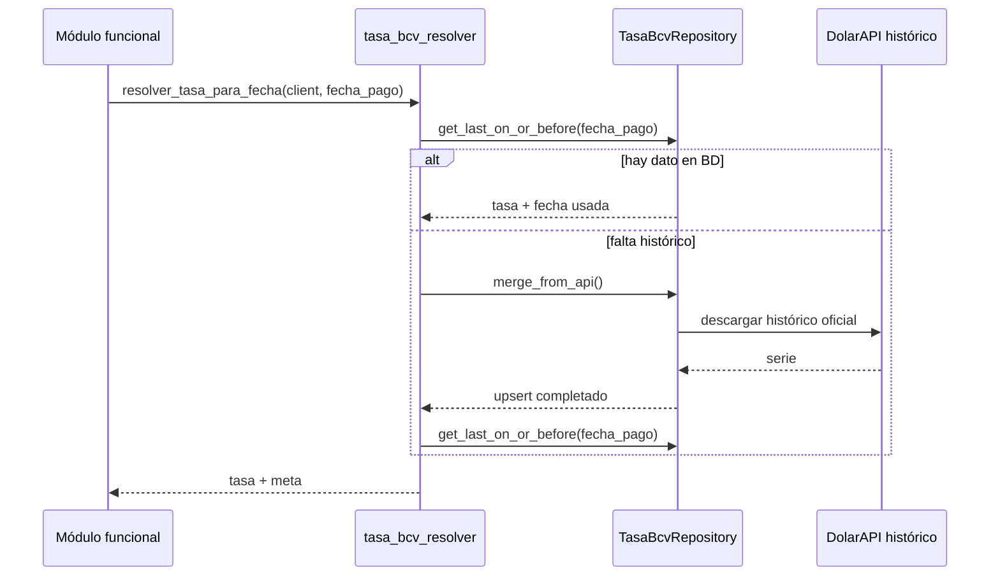

# Tasa BCV y moneda

## Función principal
Resolver la tasa oficial Bs./USD y usarla de forma consistente en login, pagos, gastos, recibos, reportes y mantenimiento de datos históricos.

## Conceptos
- `tasa BCV oficial`: referencia oficial de Bs. por 1 USD.
- `tasa de sesión`: tasa visible y reutilizable cargada en `st.session_state`.
- `tasa de respaldo`: tasa guardada en el condominio cuando no hay tasa oficial disponible.
- `tasas_bcv_dia`: tabla cacheada de histórico BCV para resolución por fecha.

## Fuentes y prioridad

### 1. Tasa en tiempo real para UI
`utils.bcv_rate.fetch_bcv_rate()` intenta en orden:
1. scraping de `https://www.bcv.org.ve/`
2. API pública `https://ve.dolarapi.com/v1/dolares/oficial`
3. fallback a `0.0`

### 2. Tasa histórica por fecha de pago
`utils.tasa_bcv_resolver.resolver_tasa_para_fecha(client, fecha_pago)` intenta en orden:
1. tabla `tasas_bcv_dia`
2. sincronización desde API histórica y relectura
3. primera tasa histórica disponible si la fecha es anterior al dataset

## Subproceso: resolución de tasa para un pago

### Entradas
| Parámetro | Tipo | Obligatorio |
|---|---|---|
| `fecha_pago` | `date | str` | Sí |
| `client` | Supabase Client | Sí |

### Devuelve
| Campo | Tipo | Descripción |
|---|---|---|
| `tasa` | `float | None` | Bs. por 1 USD |
| `meta` | string | Trazabilidad de la fecha usada |

### Salidas posibles de `meta`
- fecha exacta: `2026-03-15`
- fallback al día previo disponible: `2026-03-16→2026-03-15`
- fecha antes del histórico: `antes_histórico→YYYY-MM-DD`
- sin datos: `sin_datos`, `sin_datos_bd`, `sin_datos_api`

### Diagrama de secuencia


## Subproceso: conversión Bs. a USD

### Entradas
| Parámetro | Tipo | Obligatorio |
|---|---|---|
| `monto_bs` | float | Sí |
| `tasa_bs_por_usd` | float | Sí |

### Devuelve
- `monto_usd_desde_bs(monto_bs, tasa)` retorna USD redondeado a 2 decimales.
- Si la tasa no es positiva, retorna `0.0`.

## Casos de uso verificados

### Login y selección de condominio
- La UI intenta mostrar tasa BCV fresca al iniciar sesión.
- Si falla, usa la tasa guardada en el condominio.

### Pagos
- El pago usa la tasa oficial del día del comprobante.
- Si no se consigue, usa tasa de sesión o del condominio; como último recurso, `1.0` para no romper persistencia.

### Proceso mensual y gastos
- La tasa de un gasto se resuelve con la fecha real del movimiento.
- Si la fecha supera el fin del período, se topa a la fecha de cierre del período.

### Recibos y reportes
- Los recibos reutilizan `monto_usd` persistido o recalculan desde `monto_bs / tasa_cambio`.
- Los reportes usan `tasa_efectiva()` desde sesión o condominio.

## Ejemplos de payloads / datos persistidos

### Fila histórica de `tasas_bcv_dia`
```json
{
  "fecha": "2026-03-15",
  "tasa_bs_por_usd": 97.15,
  "fuente": "oficial"
}
```

### Pago ya convertido y persistido
```json
{
  "fecha_pago": "2026-03-15",
  "monto_bs": 120.5,
  "tasa_cambio": 97.15,
  "monto_usd": 1.24
}
```

## Tablas Supabase implicadas
| Tabla | Uso |
|---|---|
| `tasas_bcv_dia` | histórico cacheado de tasas oficiales por fecha |
| `pagos` | persistencia de `monto_bs`, `monto_usd`, `tasa_cambio` |
| `movimientos` | persistencia de equivalentes USD en egresos e ingresos |
| `condominios` | tasa de respaldo por condominio |

## Parámetros y funciones clave
| Función | Entrada | Devuelve | Uso |
|---|---|---|---|
| `fetch_bcv_rate()` | ninguna | `(tasa, fuente)` | Header, login, sesión |
| `resolver_tasa_para_fecha(client, fecha)` | cliente + fecha | `(tasa, meta)` | Pagos, proceso mensual |
| `tasa_bcv_bs_por_usd_para_fecha_con_serie(fecha, serie)` | fecha + serie | `(tasa, meta)` | Scripts y fallback avanzado |
| `monto_usd_desde_bs(monto_bs, tasa)` | monto + tasa | `float` | Persistencia y visualización |

## Script de mantenimiento verificado
- Wrapper recomendado: `bash scripts/reprocesar_tasas_pagos_bcv.sh --sync-api --apply`
- Objetivo: recalcular `tasa_cambio` y `monto_usd` en tabla `pagos` según la tasa BCV del día de `fecha_pago`.
- Requisito previo: aplicar `scripts/fase7_tasas_bcv_dia_migration.sql`.
- Recomendación técnica: usar `SUPABASE_SERVICE_KEY` para evitar bloqueos por RLS.

## Archivos clave
- `utils/bcv_rate.py`
- `utils/tasa_bcv_resolver.py`
- `utils/dolar_oficial_ve.py`
- `repositories/tasa_bcv_repository.py`
- `scripts/reprocesar_tasas_pagos_bcv.py`
- `scripts/reprocesar_tasas_pagos_bcv.sh`
