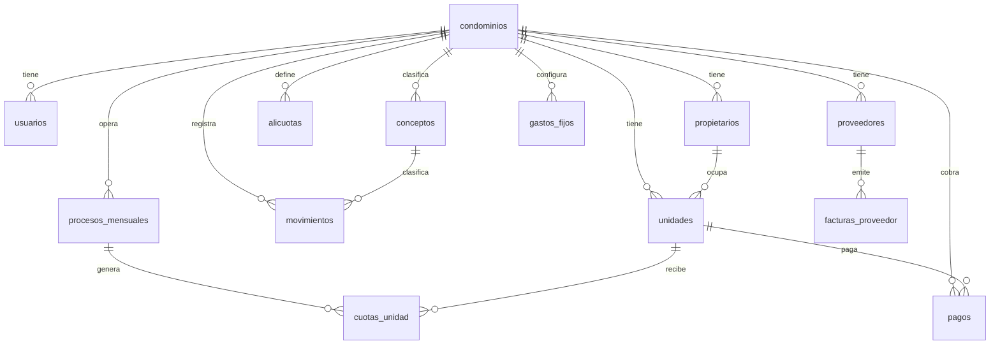

# Modelo de datos

Este anexo resume tabla por tabla el propósito funcional, claves y relaciones más relevantes del sistema.

## Lectura rápida
- `PK`: clave primaria.
- `FK`: clave foránea.
- `Multi-condominio`: si la tabla se particiona por `condominio_id`.

## Catálogos base

### `paises`
- Propósito: catálogo de países soportados.
- PK: `id`
- Campos clave: `nombre`, `codigo_iso`, `moneda`, `simbolo_moneda`
- Relación: 1:N con `tipos_documento`, `condominios`

### `tipos_documento`
- Propósito: tipos fiscales por país.
- PK: `id`
- FK: `pais_id -> paises.id`
- Campos clave: `nombre`, `formato_regex`, `descripcion`
- Relación: usado por `condominios` y `proveedores`

## Núcleo administrativo

### `condominios`
- Propósito: entidad principal de operación.
- PK: `id`
- Multi-condominio: tabla raíz
- Campos clave: `nombre`, `direccion`, `pais_id`, `tipo_documento_id`, `numero_documento`, `mes_proceso`, `tasa_cambio`, `moneda_principal`, `activo`
- Relaciones salientes: `usuarios`, `proveedores`, `propietarios`, `unidades`, `alicuotas`, `servicios`, `conceptos`, `gastos_fijos`, `movimientos`, `pagos`, `procesos_mensuales`

### `usuarios`
- Propósito: perfil operativo que complementa Supabase Auth.
- PK: `id`
- FK: `condominio_id -> condominios.id`
- Campos clave: `nombre`, `email`, `rol`, `activo`, `ultimo_acceso`
- Observación: la contraseña no vive aquí, vive en Supabase Auth.

### `propietarios`
- Propósito: titulares o contactos de unidades.
- PK: `id`
- FK: `condominio_id -> condominios.id`
- Campos clave: `nombre`, `cedula`, `telefono`, `correo`, `direccion`, `activo`
- Relación: 1:N con `unidades` y N:M mediante `unidad_propietarios`

### `unidades`
- Propósito: elemento cobrable y distribuible del condominio.
- PK: `id`
- FK: `condominio_id -> condominios.id`, `propietario_id -> propietarios.id`, `alicuota_id -> alicuotas.id`
- Campos clave: `codigo`, `tipo_propiedad`, `indiviso_pct`, `saldo`, `estado_pago`, `activo`
- Restricciones conocidas: unicidad por `condominio_id + codigo` vía migración.

### `unidad_propietarios`
- Propósito: relación histórica o múltiple entre unidades y propietarios.
- PK: `id`
- FK: `unidad_id -> unidades.id`, `propietario_id -> propietarios.id`
- Campos clave: `activo`, `es_principal`

### `empleados`
- Propósito: personal administrativo u operativo del condominio.
- PK: `id`
- FK: `condominio_id -> condominios.id`
- Campos clave: `nombre`, `cargo`, `area`, `telefono_celular`, `activo`

### `proveedores`
- Propósito: terceros que prestan servicios o emiten facturas.
- PK: `id`
- FK: `condominio_id -> condominios.id`, `tipo_documento_id -> tipos_documento.id`
- Campos clave: `nombre`, `numero_documento`, `contacto`, `saldo`, `activo`

## Configuración financiera

### `alicuotas`
- Propósito: reglas de distribución proporcional.
- PK: `id`
- FK: `condominio_id -> condominios.id`
- Campos clave: `descripcion`, `autocalcular`, `cantidad_unidades`, `total_alicuota`, `activo`

### `fondos`
- Propósito: reservas o fondos especiales.
- PK: `id`
- FK: `condominio_id -> condominios.id`, `alicuota_id -> alicuotas.id`
- Campos clave: `nombre`, `saldo_inicial`, `saldo`, `tipo`, `cantidad`, `activo`

### `servicios`
- Propósito: catálogo de servicios del condominio.
- PK: `id`
- FK: `condominio_id -> condominios.id`
- Campos clave: `nombre`, `precio_unitario`, `activo`
- Observación: la UI actual no usa precio fijo como eje de cálculo.

### `conceptos`
- Propósito: clasificación contable de movimientos.
- PK: `id`
- FK: `condominio_id -> condominios.id`
- Campos clave: `nombre`, `tipo`, `activo`
- Observación: el código activo trabaja con `gasto` y `ajuste`.

### `gastos_fijos`
- Propósito: egresos recurrentes del mes.
- PK: `id`
- FK: `condominio_id -> condominios.id`, `alicuota_id -> alicuotas.id`
- Campos clave: `descripcion`, `monto`, `tipo_gasto`, `activo`

### `conceptos_consumo`
- Propósito: catálogo de conceptos variables por consumo.
- PK: `id`
- FK: `condominio_id -> condominios.id`
- Campos clave: `nombre`, `unidad_medida`, `precio_unitario`, `tipo_precio`, `activo`

### `cuentas_bancos`
- Propósito: cuentas bancarias o de caja del condominio.
- PK: `id`
- FK: `condominio_id -> condominios.id`
- Campos clave: `descripcion`, `numero_cuenta`, `saldo_inicial`, `saldo`, `moneda`, `activo`

## Operación financiera

### `facturas_proveedor`
- Propósito: cuentas por pagar a proveedores.
- PK: `id`
- FK: `condominio_id -> condominios.id`, `proveedor_id -> proveedores.id`
- Campos clave: `numero`, `fecha`, `fecha_vencimiento`, `total`, `pagado`, `saldo`, `mes_proceso`, `activo`
- Observación: `saldo` es columna generada como `total - pagado` en el esquema base.

### `movimientos`
- Propósito: libro bancario/importado del período.
- PK: `id`
- FK: `condominio_id -> condominios.id`, `concepto_id -> conceptos.id`, `unidad_id -> unidades.id`, `propietario_id -> propietarios.id`
- Campos clave: `periodo`, `fecha`, `descripcion`, `referencia`, `tipo`, `monto_bs`, `monto_usd`, `tasa_cambio`, `estado`, `fuente`
- Valores relevantes:
  - `tipo`: `egreso`, `ingreso`
  - `estado`: `pendiente`, `clasificado`, `procesado`
  - `fuente`: `manual`, `excel`

### `pagos`
- Propósito: cobros registrados a unidades.
- PK: asumida `id` por uso en repositorios
- FK: `condominio_id`, `unidad_id`, `propietario_id`
- Campos observados en código: `periodo`, `fecha_pago`, `monto_bs`, `monto_usd`, `tasa_cambio`, `metodo`, `referencia`, `observaciones`, `estado`
- Observación: se usa extensamente aunque su definición no está completa en el esquema raíz mostrado; el contrato real sale del código activo.

### `conciliaciones`
- Propósito: soportar conciliación bancaria por período.
- PK: `id`
- FK: `condominio_id`
- Campos observados: `periodo` y vínculos operativos con movimientos.

### `cobros_extraordinarios`
- Propósito: cargos adicionales a cuotas ordinarias.
- PK: implícita por uso repositorio
- Relación: proceso mensual, cuotas por unidad y pagos.

## Cierre mensual

### `procesos_mensuales`
- Propósito: estado agregado del ciclo del mes.
- PK: `id`
- FK: `condominio_id -> condominios.id`
- Campos clave: `periodo`, `total_gastos_bs`, `total_gastos_usd`, `fondo_reserva_bs`, `total_facturable_bs`, `estado`, `closed_at`
- Restricción: unicidad por `condominio_id + periodo`

### `cuotas_unidad`
- Propósito: resultado del cálculo mensual por unidad.
- PK: `id`
- FK: `proceso_id -> procesos_mensuales.id`, `unidad_id -> unidades.id`, `propietario_id -> propietarios.id`, `condominio_id -> condominios.id`
- Campos clave: `periodo`, `alicuota_valor`, `cuota_calculada_bs`, `saldo_anterior_bs`, `pagos_mes_bs`, `total_a_pagar_bs`, `estado`

## Comunicación y soporte monetario

### `notificaciones_enviadas`
- Propósito: auditoría de correos de mora u otras notificaciones.
- PK: asumida `id`
- FK: `condominio_id`, `unidad_id`
- Campos observados: `periodo`, `propietario_email`, `propietario_nombre`, `asunto`, `cuerpo`, `enviado`, `error_mensaje`, `tipo`, `enviado_at`

### `tasas_bcv_dia`
- Propósito: caché histórico de tasa oficial Bs./USD.
- PK: `fecha`
- Campos clave: `tasa_bs_por_usd`, `fuente`, `actualizado_at`
- Restricción: `tasa_bs_por_usd > 0`

## Relaciones dominantes

## Notas importantes
- El código activo es la fuente más confiable cuando el esquema histórico y las migraciones no coinciden exactamente.
- Algunas tablas muy usadas (`pagos`, `notificaciones_enviadas`, `cobros_extraordinarios`, `conciliaciones`) se infieren mejor desde repositorios y páginas que desde un único SQL consolidado.
