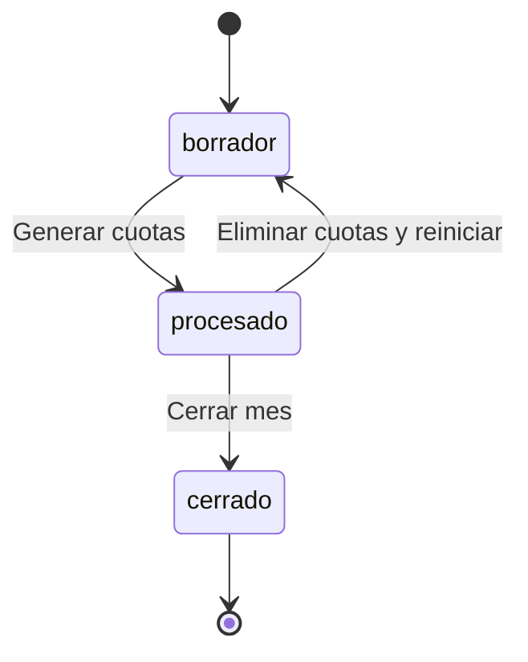
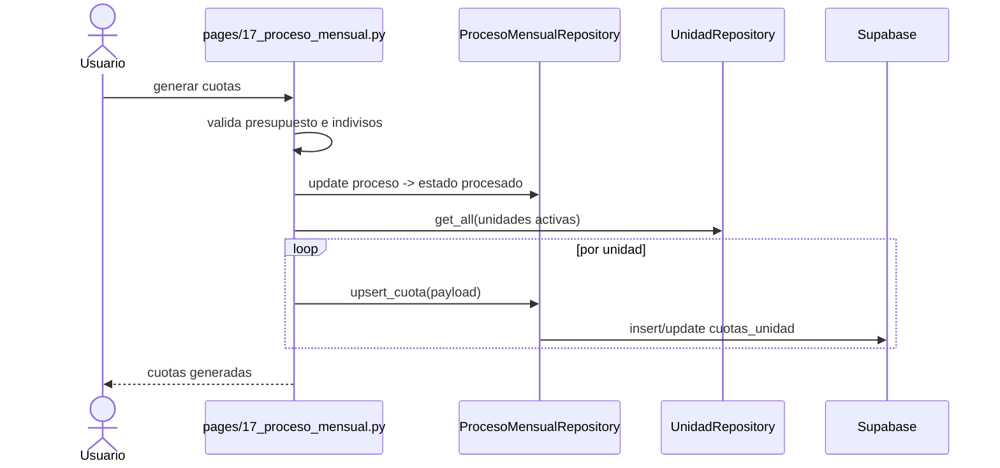
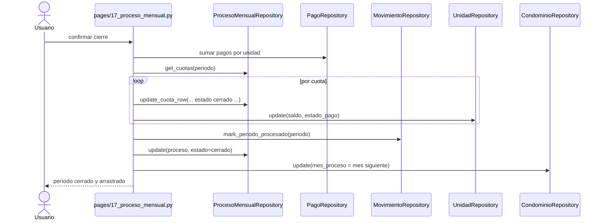

# Estados del proceso mensual

## Propósito
Explicar cómo avanza un período dentro del sistema, qué eventos cambian su estado y qué bloqueos impiden seguir avanzando.

## Estados verificados
- `borrador`
- `procesado`
- `cerrado`

## Significado funcional de cada estado

### `borrador`
- El período existe o acaba de ser creado.
- Aún se pueden registrar gastos, presupuesto y ajustes previos.
- No hay cierre contable definitivo.

### `procesado`
- Ya se generaron cuotas para las unidades del período.
- El sistema considera el mes listo para recibir pagos y preparar cierre.
- Desde aquí se puede cerrar el mes si existen cuotas.

### `cerrado`
- El período quedó consolidado.
- Los saldos nuevos ya fueron trasladados a `unidades.saldo`.
- Los movimientos del período fueron marcados como `procesado`.
- `condominios.mes_proceso` avanzó al siguiente mes.
- No se pueden registrar nuevos pagos para ese período.

## Flujo de estados


## Eventos que disparan transición

### 1. Creación o recuperación del período
- Método: `ProcesoMensualRepository.get_or_create(condominio_id, periodo)`
- Resultado: si no existe fila en `procesos_mensuales`, la crea en `borrador`.

### 2. Generar cuotas
- Disparador UI: botón `Generar cuotas`
- Reglas previas:
  - el período no debe estar `cerrado`
  - debe existir presupuesto mayor que cero
  - la suma de indivisos debe validar como 100%
  - si ya existen cuotas, el usuario debe confirmar regeneración
- Efectos:
  - actualiza `procesos_mensuales.estado = "procesado"`
  - hace `upsert` en `cuotas_unidad` por cada unidad activa
  - inicializa `pagos_mes_bs`, `mora`, `mora_bs`, `cobros_extraordinarios`

### 3. Reiniciar a borrador
- Disparador UI: `Eliminar cuotas y volver a borrador`
- Efectos:
  - borra todas las filas `cuotas_unidad` del `proceso_id`
  - actualiza `procesos_mensuales.estado = "borrador"`
- No borra:
  - gastos del período
  - presupuesto

### 4. Cerrar mes
- Disparador UI: `Cerrar mes` + confirmación final
- Reglas previas:
  - `puede_cerrar_mes(estado_proc)` debe devolver `true`
  - eso implica `estado_proc == "procesado"`
  - debe haber cuotas generadas
- Efectos:
  - consolida pagos del período por unidad
  - calcula mora si aplica
  - incorpora cobros extraordinarios del período
  - recalcula `cuotas_unidad.total_a_pagar_bs`
  - marca cada fila de `cuotas_unidad.estado = "cerrado"`
  - actualiza `unidades.saldo` y `unidades.estado_pago`
  - ejecuta `repo_mov.mark_periodo_procesado(condominio_id, periodo_db)`
  - actualiza `procesos_mensuales.estado = "cerrado"` y `closed_at`
  - mueve `condominios.mes_proceso` al mes siguiente

## Reglas de habilitación

### `puede_generar_cuotas(estado_proceso)`
- `true` si el estado NO es `cerrado`
- `false` si el estado es `cerrado`

### `puede_cerrar_mes(estado_proceso)`
- `true` solo si el estado es `procesado`
- `false` para `borrador` y `cerrado`

### `periodo_permite_pagos(estado_proceso)`
- `false` si hay un proceso explícitamente `cerrado`
- `true` si no existe fila de proceso o si no está cerrado

## Datos que participan en el cálculo de cierre
| Fuente | Campo / cálculo | Uso |
|---|---|---|
| `unidades` | `saldo`, `indiviso_pct` | saldo arrastrado y cuota base |
| `pagos` | suma por unidad y período | abonos aplicados |
| `cobros_extraordinarios_unidad` | monto por unidad | cargos adicionales |
| configuración de mora | `pct_mora`, vigencia | mora del período |
| presupuesto | `monto_bs` | cuota ordinaria |

## Diagrama de secuencia: generar cuotas


## Diagrama de secuencia: cerrar mes


## Payloads relevantes

### Proceso al pasar a `procesado`
```json
{
  "total_gastos_bs": 2400.0,
  "fondo_reserva_bs": 240.0,
  "total_facturable_bs": 2640.0,
  "estado": "procesado"
}
```

### Cuota generada por unidad
```json
{
  "proceso_id": 9,
  "unidad_id": 18,
  "propietario_id": 42,
  "condominio_id": 3,
  "periodo": "2026-03-01",
  "alicuota_valor": 0.045,
  "total_gastos_bs": 2400.0,
  "cuota_calculada_bs": 108.0,
  "saldo_anterior_bs": 30.0,
  "pagos_mes_bs": 0.0,
  "mora": 0.0,
  "mora_bs": 0.0,
  "pct_mora": 0.0,
  "cobros_extraordinarios": 0.0,
  "total_a_pagar_bs": 138.0,
  "estado": "pendiente"
}
```

### Cuota consolidada en cierre
```json
{
  "pagos_mes_bs": 120.5,
  "mora": 10.0,
  "mora_bs": 10.0,
  "pct_mora": 5.0,
  "cobros_extraordinarios": 12.5,
  "total_a_pagar_bs": 40.0,
  "estado": "cerrado"
}
```

## Tablas implicadas
- `procesos_mensuales`
- `cuotas_unidad`
- `movimientos`
- `pagos`
- `unidades`
- `condominios`
- `cobros_extraordinarios`
- `cobros_extraordinarios_unidad`

## Riesgos operativos
- Si la suma de indivisos no llega a 100%, no se deben generar cuotas.
- Si se cierran meses sin cuotas correctas, el saldo arrastrado de unidades queda contaminado.
- Reiniciar cuotas no revierte pagos ni gastos; solo rehace el cálculo mensual.
