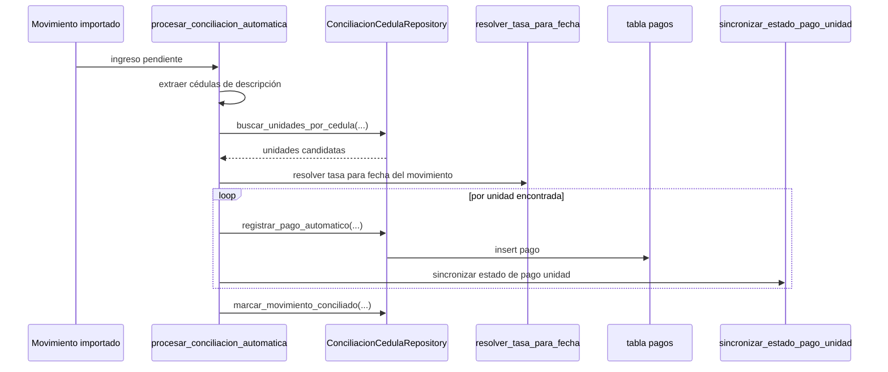
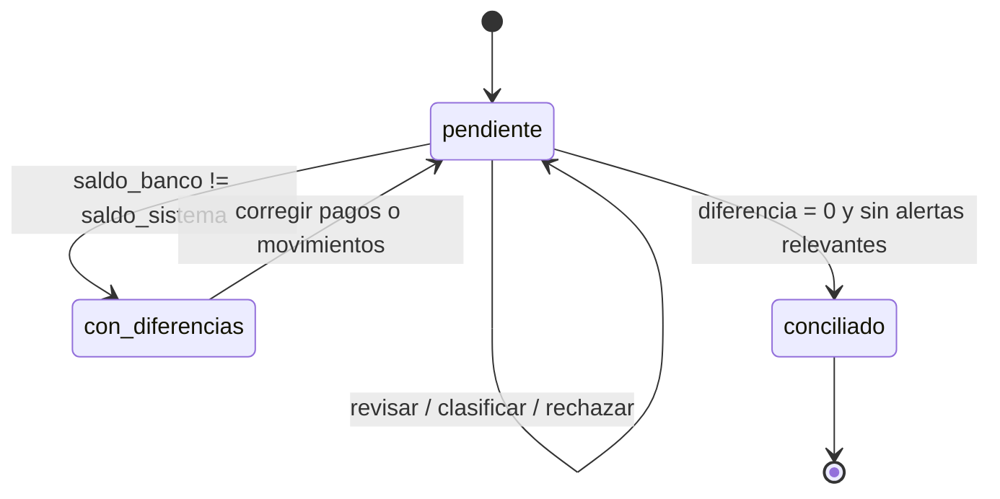

# Conciliación bancaria

## Propósito
Explicar cómo el sistema compara movimientos bancarios con pagos registrados, cómo sugiere coincidencias, cómo genera pagos automáticos por cédula y cuándo permite cerrar la conciliación de un período.

## Conceptos
- `movimiento conciliado`: ingreso bancario vinculado a un pago del sistema.
- `pago sin movimiento`: pago registrado en la app que no tiene respaldo en el libro bancario conciliado.
- `alerta`: señal de posible inconsistencia entre banco y sistema.
- `conciliación automática por cédula`: proceso que crea pagos a partir de una cédula detectada en la descripción bancaria.

## Estados operativos del movimiento
- `conciliado = true`: el ingreso quedó enlazado a un `pago_id`
- `conciliado = false`: sigue pendiente o fue revisado sin vínculo
- `revisado = true`: alguien tomó decisión sobre el caso
- `tipo_alerta`: clasifica la inconsistencia observada

## Subproceso: resumen del período

### Qué calcula
`ConciliacionRepository.obtener_estado_periodo(condominio_id, periodo_db)` devuelve:
- total de movimientos bancarios de ingreso
- cuántos están conciliados
- cuántos siguen sin conciliar
- saldo del banco según movimientos
- saldo del sistema según pagos
- diferencia entre ambos
- estado global del período: `conciliado`, `pendiente`, `con_diferencias`

### Regla de estado global
- `con_diferencias`: cuando `saldo_banco != saldo_sistema`
- `pendiente`: cuando hay ingresos sin conciliar o alertas no revisadas
- `conciliado`: cuando no hay diferencia y no quedan alertas pendientes

## Subproceso: sugerencia manual de vinculación

### Orden de confianza
1. coincidencia exacta por `referencia`
2. monto similar y misma semana
3. mismo monto dentro del mismo mes

### Respuesta típica
```json
{
  "pago": {
    "id": 301,
    "monto_bs": 120.5,
    "referencia": "99881234"
  },
  "confianza": "alta",
  "razon": "referencia"
}
```

### Acciones disponibles
- `confirmar_vinculacion(movimiento_id, pago_id, usuario)`
- `rechazar_vinculacion(movimiento_id, "sin_pago_sistema", usuario)`

## Subproceso: conciliación automática por cédula

### Qué hace
Lee la descripción de ingresos ya importados, extrae cédulas, busca propietarios y unidades del condominio, clasifica el pago y registra uno o varios pagos automáticos.

### Flujo resumido


### Motivos de omisión verificados
- `no_ingreso`
- `sin_id_movimiento`
- `ya_conciliado`
- `sin_cedula`
- `sin_coincidencia`
- `sin_pago_nuevo`
- `error_interno`

### Tipos de pago generados
La clasificación la decide `clasificar_pago(...)` y puede producir:
- `total`
- `parcial`
- `extraordinario`

### Payload de pago automático
```json
{
  "condominio_id": 3,
  "unidad_id": 18,
  "propietario_id": 42,
  "periodo": "2026-03-01",
  "fecha_pago": "2026-03-14",
  "monto_bs": 120.5,
  "monto_usd": 1.24,
  "tasa_cambio": 97.15,
  "metodo": "transferencia",
  "referencia": "99881234",
  "estado": "confirmado",
  "tipo_pago": "total",
  "origen": "conciliacion_automatica",
  "movimiento_id": 801
}
```

## Alertas de conciliación

### Tipos verificados
- `fecha_fuera_periodo`
- `sin_pago_sistema`
- `pago_parcial`
- `pago_superior`
- `monto_no_coincide`

### Regla de clasificación
La función `clasificar_alerta(monto_banco, monto_sistema, fecha_mov, periodo)` evalúa en este orden:
1. fecha fuera del período
2. no existe pago en sistema
3. pago parcial
4. pago superior
5. monto distinto
6. sin alerta

## Subproceso: pagos registrados sin movimiento
El sistema detecta pagos del período que no aparecen vinculados desde `movimientos.pago_id`.

Esto sirve para responder la pregunta:
- “¿Registré un pago en la app, pero nunca apareció en el banco conciliado?”

## Cierre de conciliación

### Regla crítica
Solo se puede cerrar si la diferencia es exactamente `Bs. 0,00`.

### Qué persiste
Inserta una fila en `conciliaciones` con:
- `condominio_id`
- `periodo`
- `saldo_banco`
- `saldo_sistema`
- `estado = "conciliado"`
- cantidad de movimientos banco
- cantidad de movimientos conciliados
- cantidad de pagos sin movimiento
- `created_by`

### Payload de cierre
```json
{
  "condominio_id": 3,
  "periodo": "2026-03",
  "saldo_banco": 2450.0,
  "saldo_sistema": 2450.0,
  "estado": "conciliado",
  "movimientos_banco": 18,
  "movimientos_conciliados": 18,
  "pagos_sin_movimiento": 0,
  "created_by": "admin@condominio.com"
}
```

## Diagrama de estados de conciliación


## Tablas implicadas
- `movimientos`
- `pagos`
- `conciliaciones`
- `unidades`
- `propietarios`
- `condominios`

## Riesgos operativos
- Si el extracto se importa con período incorrecto, la conciliación mostrará pendientes falsos.
- Si la descripción bancaria no trae cédula usable, la conciliación automática no generará pagos.
- Si se confirma una sugerencia incorrecta, el movimiento queda conciliado con el pago equivocado hasta corregir manualmente.
